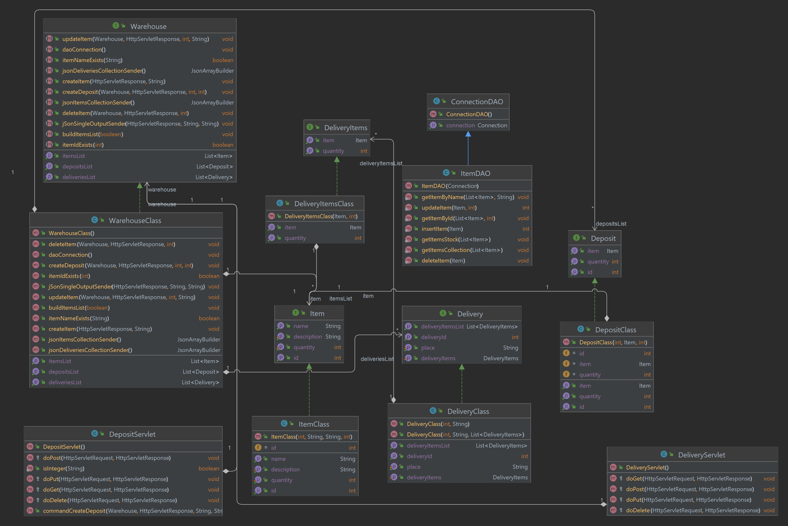

# Transport Management Application
Company's Transport Management Application is an academic project developed for Parallel and Distributed System's 
curricular unit.

## Project's Description
It was requested the development of an application who could manage the transport of company's items. The company has a
central warehouse from where the deliveries are originated. The warehouse must have the quantity of items in stock
for the delivery to be executed.

## Project Development

### Architecture

 The users can access the system by two separate ways: through the web page or directly at the REST API using http requests.
Either way, the system's one only entry point is the REST API. When the webpage is used, the node server uses the same
API to process their requests. It is on the API node that the java program handles the logic, business rules and access 
the database. No other node has direct access to the database node. 
The implementation was done using three nodes:
1. **Docker Alpine** container running POSTGRES database.
2. **Docker Wildfly** container where the JAVA REST API is deployed(and connected do the #1)
3. **NODE.JS WebServer** which runs on the local machine(through the command line or inside INTELLIJ) 

The user on the local machine can use either the web page on the localhost or use postman(or similar) to access directly
the api node.

### Class Diagram

### Entity-Relation

### Languages and Tools
The JAVA (15) API was developed on JetBrains INTELLIJ IDEA - ULTIMATE EDITION 
[PlantUML](https://plantuml.com) was used for the diagrams(except the class diagram, made in INTELLIJ) 
[Postman](https://www.postman.com) for testing the API. 
### REST API's Operations

| HTTP Method |                url                |        Param         |                            Op. Description                             |                 HTTP response code (OK)                 |    HTTP response code (NOK)     |   HTTP response code (NOK)    |
|:-----------:|:---------------------------------:|:--------------------:|:----------------------------------------------------------------------:|:-------------------------------------------------------:|:-------------------------------:|:-----------------------------:|
|     GET     |   http://localhost:8080/items/    |         n/a          |                returns a JSON of all items in database                 | [{"name":"rocha","description":"rocha","quantity":"15}] |    {"error":"no items found}    |              n/a              |
|     GET     | http://localhost:8080/items/stock |         n/a          | returns a JSON of all items whose quantity in stock >0 in the database | [{"name":"rocha","description":"rocha","quantity":"15}] |    {"error":"no items found}    |              n/a              |
|    POST     |   http://localhost:8080/items/    |   name=impressora    |                            Creates new item                            |       {"impressora";"item guardado com sucesso"}        |   {"nome":"valor já existe!"}   |              n/a              |
|     PUT     |   http://localhost:8080/items/6   |  description=folha   |                     Changes an item's description                      |            {"6":"item guardado com sucesso"}            |               n/a               |              n/a              |
|   DELETE    |   http://localhost:8080/items/2   |         n/a          |                                  n/a                                   |                           n/a                           |               n/a               |              n/a              |
|    POST     |  http://localhost:8080/deposit/   | itemId=2&quantity=25 |           Deposits some quantity in an already existent item           |       {"<Item name>":"item guardado com sucesso"}       | {"erro":"opção não disponível"} | {"nome":"item não existente"} |

## Quick Start/Instalation Guidelines
### Instructions to run the project on a windows machine with INTELLIJ and docker on WSL2

1. Clone the repository
2. `mvn clean package` on INTELLIJ
3. inside WSL2 go to the project's root and execute the command `docker compose up` to start the containers
4. on the z.sql_scripts folder there are script files to create the db and schema. Inside that folder execute the following commands in order(password is "sdp":
   1. `psql -h localhost -U postgres -f database.sql`
   2. `psql -h localhost -U postgres -d amv_transports -f tables.sql`
   3. `psql -h localhost -U postgres -d amv_transports -f values.sql`
   4. **note**: if needed, use `psql -h localhost -U postgres -d amv_transports` to access the database directly 
5. Copy the SDP_Project.war file(it is inside the app/ folder on the Wildfly container) to the deployments folder
   1. `docker exec -it <wildfly container name> bash`
   2. `cp SDP_Project.war /optjboss/wildfly/standalone/deployments`

**THE API is now running and listening on localhost:8080**

 

## Documentation
The project's source code was documented using [javadoc](https://docs.oracle.com/javase/7/docs/technotes/tools/windows/javadoc.html). The newest version of the documentation is stored under the "javadoc" folder 

#### Disclamer:This is an academic work, developed solely for educational purposes, it is not tested or ready for a production environment

## License & copyright
© [Artur Fernandes](https://github.com/Artur30002667), [Miguel Alves](https://github.com/mogilev), [Valter Vitorino](https://github.com/valtervitorino)

Licensed under the [MIT License](LICENSE)